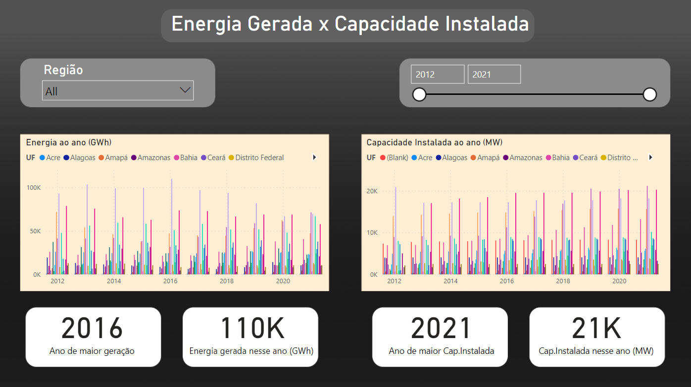

# Dashboard para Análise do Anuário Estatístico de Energia

## Objetivos e Motivação

Disponível no http://shinyepe.brazilsouth.cloudapp.azure.com:3838/anuario-livro/#27_Demandas_Máximas_(MW). O Anuário Estatístico de Energia Elétrica tem como objetivo divulgar dados de distribuição de energia na rede elétrica nos últimos 10 anos.

Como forma de simplificar a visualização das principais informações nacionais desse Anuário, foi desenvolvido por mim um Dashboard em Power BI que facilite a visualização e comparação desses dados, trazendo um dinamismo para a apresentação das informações, seu acesso é diante do link: https://app.powerbi.com/view?r=eyJrIjoiZjI5ZmZmNDItZjA3ZS00ZjA4LWE4OWYtNGZiNWE5Zjc2NWY2IiwidCI6ImMzN2IzN2EzLWU5ZTItNDJmOS1iYzY3LTRiOWI3MzhlMWRmMCJ9

## Método

O Dashboard foi dividido em 5 Telas principais:

- Panorama Energético Nacional
- Consumo Energético
- Geração por fonte
- Energia Gerada X Capacidade Instalada
- Demanda X Capacidade Instalada

A partir dessas 5 telas, se analisa 4 variáveis principais disponíveis no relatório: Capacidade Instalada, Consumo, Demanda e Energia Gerada.

## Desenvolvimento

No ambiente de desenvolvimento deste projeto, passaremos por todas as telas do BI e analisaremos os principais insights que elas podem nos trazer

#### Tela 1 - Panorama Energético Nacional

É possível observar que a capacidade instalada tem tido um crescimento de 80mil MW enquanto que a demanda cresceu apenas 13mil MW.

Assim como, para comparação de geração e consumo, a geração aumentou próximo a 100mil GWh, enquanto que o consumo aumentou 50mil Gwh

A partir disso formulamos as seguintes hipóteses.

1. Em termos de capacidade instalada,o crescimento está sendo satisfatório em manter o Brasil em uma zona segura de abastecimento energético.
   
2. A matriz energética brasileira e sua gestão conseguiram lidar com a crise e não houve risco de não conseguir suprir o abastecimento de consumidores de energia.

3. Os problemas de geração e abastecimento de energia não são causados por falta de recursos, mas sim por mal planejamento.

A seguir analisamos as telas e o que seus dados dizem para nós e posteriormente tentamos relacionar tais conclusões com as hipóteses formuladas anteriormente.

#### Tela 2 - Consumo Energético

Na tela de consumo, temos algumas informações mais nichadas sobre a distribuição presente no país.

A partir dela podemos afirmar que:

- As classes industriais e residenciais somadas representam 2/3 do Consumo brasileiro

- Através do análise ano a ano, Acredita-se que o consumo livre de energia está se popularizando

- A Região Sudeste é responsável pelo consumo de metade da energia do país

- A região Norte, apesar da extensão tem um consumo baixo de energia, com apenas 7.11%

#### Tela 3 - Geração por Fonte

A Tela 3 apresenta informações sobre a geração de energia do país.

A partir dela afirmamos que:

- As energias solar e eólica vem tido um drástico aumento com o passar dos anos
  
- As energias hidráulica e nuclear vem tido uma redução parcial com o passar dos anos

- A autoprodução detém o posto de grupo mais emissor de gás CO2

- A autoprodução tem mantido um percentual constante de produção de Gás CO2, o sistema isolado tem tido uma drástica redução e o SIN um aumento parcial

#### Tela 4 - Geração x Capacidade Instalada

Comparando os dados de geração com o da tela anterior vemos que:

1- O Ano de maior geração não necessariamente será o de maior emissão GEE

2- Os Estados possuem anos de maior geração distintos

3- A maior capacidade instalada de todos os estados foram nos anos de 2020 e 2021, exceto para a região Sul

#### Tela 5 - Demanda x Capacidade Instalada

Por fim, analisando a Demanda x a capacidade instalada, é possível observar que:

1- A demanda teve um aumento de 15% em 10 anos.

2- A região nordeste teve um aumento de demanda maior que a dos demais estados

### Conclusão

Por fim, vemos que os dados gerados pelas telas podem trazer informações interessantes sobre a matriz energética brasileira ao longo dos últimos 10 anos, porém, não são o suficiente para afirmar ou rejeitar as hipóteses formuladas na tela número 1.

Isso se deve principalmente porque analisar apenas números de geração, demanda, capacidade instalada e consumo não são parâmetros suficientes para inferir boa ou má gestão e planejamento do Sistema brasileiro.

Além de ser necessário se criar telas para métricas mais específicas presentes no Anuário, também seriam necessários adicionar dados sociais e econômicos para validar as hipóteses formuladas.
